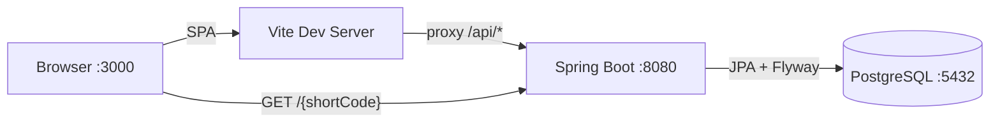
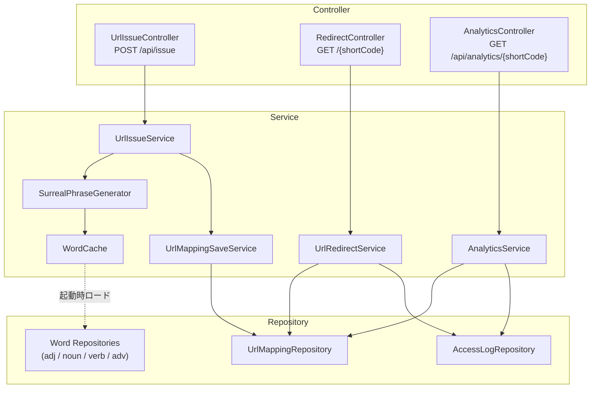

# OddLink

**"Where links get odd"** — ランダム文字列の代わりに、シュールな英語フレーズで短縮URLを生成するサービス。

```
https://example.com/very/long/url
  ↓
http://oddlink.com/purple-cat-dances-with-golden-whale
```

## なぜ作ったか

一般的なURL短縮サービスは `abc123` のようなランダム文字列を使う。機能的には十分だが、人間にとっては意味のない文字の羅列でしかない。

OddLinkでは「形容詞 + 名詞 + 動詞」などの英語フレーズを組み合わせることで、**共有したくなるURL**を生成する。記憶に残りやすく、リンクを受け取った側も思わず見てしまう「引っかかり」を作ることを狙った。

## 技術的なこだわり

### フレーズ衝突のリトライ戦略

ランダム生成である以上、既存のショートコードと衝突する可能性がある。OddLinkでは以下のアプローチで対処している:

- **楽観的アプローチ**: 事前のユニークチェック（SELECT）を省き、保存時の一意制約違反（`DataIntegrityViolationException`）で衝突を検知
- **トランザクション分離**: 保存処理を `REQUIRES_NEW` で独立トランザクションにし、リトライ時に前回の失敗が影響しないよう設計
- **最大5回リトライ**: 衝突が続く場合は503を返し、サイレントな無限ループを防止

事前チェックではなく一意制約違反をトリガーにした理由は、チェックと保存の間にレースコンディションが起きるため。DBの制約に頼る方が確実。

### フレーズ生成の仕組み

4種類の品詞（形容詞40語・名詞45語・動詞30語・副詞20語）と6種類の構文パターンを組み合わせて、シュールな英語フレーズを生成する。

```
リクエスト → SurrealPhraseGenerator
               ├─ 1. 6パターンからランダムに1つ選択
               ├─ 2. パターンの各スロットに WordCache から単語を選択
               └─ 3. ハイフンで結合してショートコードに
```

**構文パターン:**

| # | 構文 | 例 |
|---|------|-----|
| A | adj-noun-verb-to-adj-noun | `golden-clock-whispers-to-silent-butterfly` |
| B | noun-of-adj-noun-verb | `echo-of-forgotten-piano-fades` |
| C | adj-noun-verb-with-adj-noun | `floating-whale-dances-with-broken-mirror` |
| D | verb-adj-noun-into-noun | `melts-ancient-key-into-shadow` |
| E | adj-noun-adv-verb | `silent-cat-gently-whispers` |
| F | noun-adv-verb-adj-noun | `shadow-slowly-becomes-golden-light` |

全パターンの合計で**約2.5億通り**の組み合わせが可能。組み合わせ空間を広げるには、DBへの単語INSERT（コード変更不要）と構文パターンの追加の2軸がある。

この設計ではスケールを阻害する要因をアプリケーション層から排除している:

- **WordCache**: 起動時にDBから全単語をインメモリにロード。フレーズ生成時のDBアクセスがゼロになるため、リクエスト増加がDBの負荷に直結しない
- **ThreadLocalRandom**: スレッドごとに独立した乱数生成器を使用。ロック競合が発生せず、並行リクエストが増えてもスループットが落ちない
- **DB一意制約による衝突検知**: アプリ側でショートコードの重複チェック（SELECT）を行わず、保存時の制約違反で検知。アプリにステートを持たないため、インスタンスの水平スケールが容易

## アーキテクチャ

### システム全体



### バックエンド内部



## 技術スタック

| レイヤー | 技術 |
|---------|------|
| バックエンド | Java 21 / Spring Boot 3.5.9 |
| フロントエンド | React 19 / TypeScript 5.9 / Vite 7 |
| DB | PostgreSQL 17（Docker） |
| マイグレーション | Flyway |

## セットアップ

### 前提条件

- Java 21+
- Node.js 18+
- Docker

### 1. リポジトリをクローン

```bash
git clone https://github.com/your-name/oddlink.git
cd oddlink
```

### 2. 環境変数を設定

```bash
cp .env.example .env
```

`.env` を編集してDBのパスワードを設定する。

### 3. DB起動

```bash
docker compose up -d
```

### 4. バックエンド起動

```bash
./mvnw spring-boot:run
```

http://localhost:8080 で起動。

### 5. フロントエンド起動

```bash
cd frontend
npm install
npm run dev
```

http://localhost:3000 で起動。

## API仕様

### URL発行

```
POST /api/issue
Content-Type: application/json
```

リクエスト:
```json
{
  "originalUrl": "https://example.com"
}
```

レスポンス:
```json
{
  "shortUrl": "http://localhost:8080/purple-cat-dances-with-golden-whale"
}
```

### リダイレクト

```
GET /{shortCode}
```

- 存在する場合: 302リダイレクト（元のURLへ）
- 存在しない/期限切れ: 302リダイレクト（Not Foundページへ）

### アナリティクス

```
GET /api/analytics/{shortCode}
```

レスポンス:
```json
{
  "shortCode": "purple-cat-dances-with-golden-whale",
  "shortUrl": "http://localhost:8080/purple-cat-dances-with-golden-whale",
  "originalUrl": "https://example.com",
  "totalAccessCount": 42,
  "createdAt": "2025-01-01T00:00:00",
  "expiresAt": null,
  "dailyAccess": [
    { "date": "2025-01-01", "count": 10 },
    { "date": "2025-01-02", "count": 32 }
  ]
}
```

## プロジェクト構成

```
oddlink/
├── src/main/java/com/oddlink/
│   ├── controller/        # REST API
│   ├── service/           # ビジネスロジック
│   ├── entity/            # JPAエンティティ
│   ├── repository/        # データアクセス
│   ├── dto/               # リクエスト/レスポンス
│   ├── exception/         # 例外ハンドリング
│   └── config/            # CORS等の設定
├── src/main/resources/
│   ├── application.yml
│   └── db/migration/      # Flywayマイグレーション
├── frontend/
│   ├── src/
│   │   ├── components/    # UrlForm, ResultCard, ErrorMessage
│   │   ├── pages/         # Analytics, NotFound
│   │   └── hooks/         # useShorten, useAnalytics
│   ├── package.json
│   └── vite.config.ts
├── docker-compose.yml
└── pom.xml
```

## テスト

```bash
# バックエンド
./mvnw test

# 全32テスト（コントローラー・サービス・エンティティ）
```

## 今後の展望

### スケーラビリティ
- **単語プールの拡張**: 現状は135語で約2.5億パターンを生成可能だが、登録数増加に伴い衝突率が上がる。単語の追加やパターン追加で組み合わせ空間を拡張する
- **期限切れURLの定期削除**: 現状は期限切れURLがDB上に残り続ける。スケジューラによる定期削除でショートコード空間を解放する

### 機能
- **レートリミット**: API乱用防止のためのリクエスト制限

### インフラ
- **CI/CD**: GitHub Actionsによるテスト自動化とデプロイパイプライン
- **本番デプロイ**: Renderへのデプロイ（Spring Bootがフロントエンドも配信する構成）
